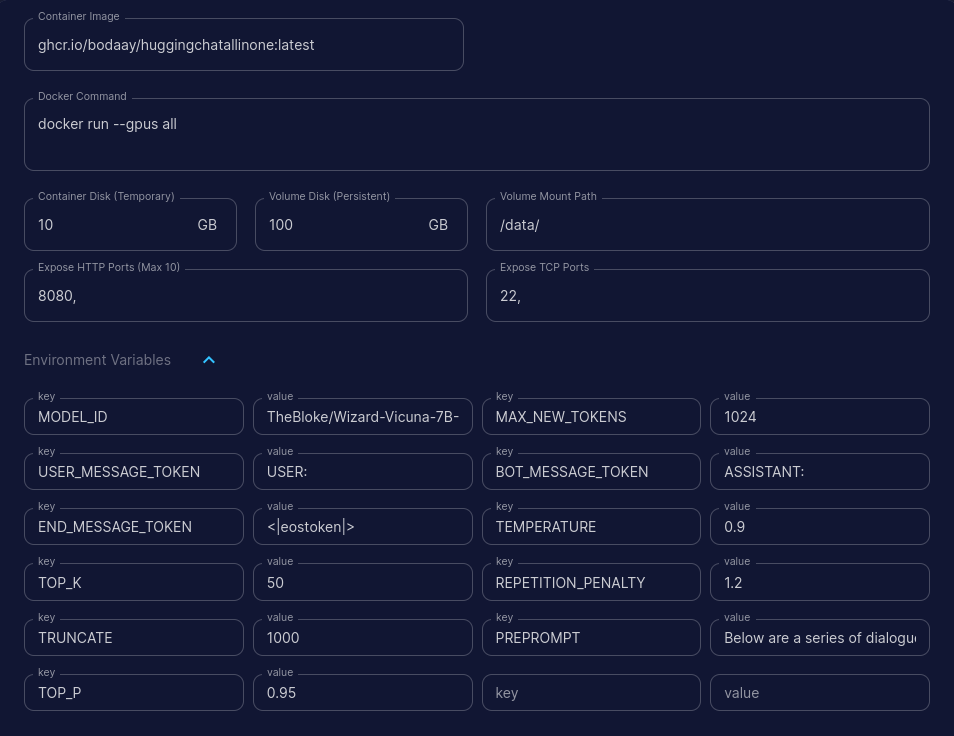

## HuggingChatAllInOne

I like HuggingChat UI, and their text generation infra structure, so wanted to build All in one docker file to run HuggingChat Frontend and Backend in one docker and on runpod.io
and it should be fairly easily to run this single docker offline given the models already downloaded.

The project built in a way that it can be easily kept up-to-date with latest changes on the original repos:
* https://github.com/huggingface/text-generation-inference/
* https://github.com/huggingface/chat-ui


## How it works

mostly the docker file is just the combination of the two dockerfile from huggingface repos, but one difficult part was the fact .env variable parameters, some of them, were being integrated at build time, this made me choose the easiset path, dynamically generate .env variable and re-build the website at run time. and I added the logic to apply some patches to original source code in some cases where its needed


In addition, Im checking if this is running under http://runpod.io, so I'll be setting the parameter PUBLIC_ORIGIN automatically (thankfully runpod.io providing env variable called RUNPOD_POD_ID)


## To Build

Building the docker image will take really long time...

```
./UpdateAllSources.sh
./BuildAllInOneDockerFile.sh
``` 
* this will build up to the latest commit I've tested, you can modify the two script availble: GetLatestBackEndSources.sh, GetLatestFrontEnd.sh to choose different commit

## to Run 

#### with Patches, no quantization
```
docker run --gpus all -p 8080:8080 -v $PWD/Data:/data -e APPLY_PATCHES=1 -e PUBLIC_ORIGIN="http://exmaple.com:8080" -e MODEL_ID='TheBloke/Wizard-Vicuna-7B-Uncensored-HF' ghcr.io/bodaay/huggingchatallinone:latest
```

#### without Patches, no quantization
```
docker run --gpus all -p 8080:8080 -v $PWD/Data:/data -e PUBLIC_ORIGIN="http://localhost:8080" -e MODEL_ID='TheBloke/Wizard-Vicuna-7B-Uncensored-HF' ghcr.io/bodaay/huggingchatallinone:latest
```

#### without Patches, gptq
```
docker run --gpus all -p 8080:8080 -v $PWD/Data:/data -e PUBLIC_ORIGIN="http://localhost:8080" -e QUANTIZE='gptq' -e MODEL_ID='TheBloke/Wizard-Vicuna-7B-Uncensored-HF' ghcr.io/bodaay/huggingchatallinone:latest
```

#### without Patches, bitsanbytes
```
docker run --gpus all -p 8080:8080 -v $PWD/Data:/data -e PUBLIC_ORIGIN="http://localhost:8080" -e QUANTIZE='bitsandbytes' -e MODEL_ID='TheBloke/Wizard-Vicuna-7B-Uncensored-HF' ghcr.io/bodaay/huggingchatallinone:latest
```

 You need to set APPLY_PATCHES in the following cases for PUBLIC_ORIGIN:

* you are not running this in https://runpod.io, or a secure https connection
* you need to access this site using ip address or non secure domain name (not http://localhost:8080), ex: http://10.0.0.1:8080, http://example.com

## Runpod Template 

The most important parameter is: MODEL_ID
this will the inference server based on that model

```
https://runpod.io/gsc?template=k8qitdzihe&ref=8s08lrw8
```
* you can replace any of the parameters here and they will follow the default value, or you can use any other parameter from original repos of huggingface/chat-ui,huggingface/text-generation-inference




* Note that PUBLIC_ORIGIN will be automatically overwritten if you are running this under runpod.io


## GPTQ Support

Only Model made with latest gptq-for-llama will work, in case of GPTQ, you need pass QUANTIZE parameter and set it to gptq


## Environment Variables

| Variable Name                         | Default Value                                                  |
| ------------------------------------- | -------------------------------------------------------------- |
| MONGODB_URL                           | mongodb://localhost:27017                                      |
| MONGODB_DB_NAME                       | bodaay-chat-ui                                                 |
| MONGODB_DIRECT_CONNECTION             | False                                                          |
| COOKIE_NAME                           | hfall-chat                                                     |
| HF_ACCESS_TOKEN                       |                                                                |
| SERPAPI_KEY                           |                                                                |
| OPENID_CLIENT_ID                      |                                                                |
| OPENID_CLIENT_SECRET                  |                                                                |
| OPENID_SCOPES                         |                                                                |
| OPENID_PROVIDER_URL                   |                                                                |
| PUBLIC_SHARE_PREFIX                   |                                                                |
| PUBLIC_GOOGLE_ANALYTICS_ID            |                                                                |
| PUBLIC_DEPRECATED_GOOGLE_ANALYTICS_ID |                                                                |
| PUBLIC_ANNOUNCEMENT_BANNERS           |                                                                |
| PARQUET_EXPORT_DATASET                |                                                                |
| PARQUET_EXPORT_HF_TOKEN               |                                                                |
| PARQUET_EXPORT_SECRET                 |                                                                |
| PUBLIC_ORIGIN                         | http://localhost:8080                                          |
| MODEL_ID                              | TheBloke/Wizard-Vicuna-7B-Uncensored-HF                        |
| USER_MESSAGE_TOKEN                    | USER:                                                    |
| BOT_MESSAGE_TOKEN                     | ASSISTANT:                                                  |
| END_MESSAGE_TOKEN                     | <\|eostoken\|>                                                   |
| PREPROMPT                             | Below are a series of dialogues between various people and an AI assistant. The AI tries to be helpful, polite, honest, sophisticated, emotionally aware, and humble-but-knowledgeable. The assistant is happy to help with almost anything, and will do its best to understand exactly what is needed. It also tries to avoid giving false or misleading information, and it caveats when it isn't entirely sure about the right answer. That said, the assistant is practical and really does its best, and doesn't let caution get too much in the way of being useful.\n-----\n |
| TEMPERATURE                           | 0.9                                                            |
| TOP_P                                 | 0.95                                                           |
| TOP_K                                 | 50                                                             |
| REPETITION_PENALTY                    | 1.2                                                            |
| TRUNCATE                              | 1000                                                           |
| MAX_NEW_TOKENS                        | 1024  

